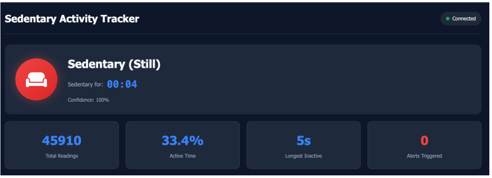
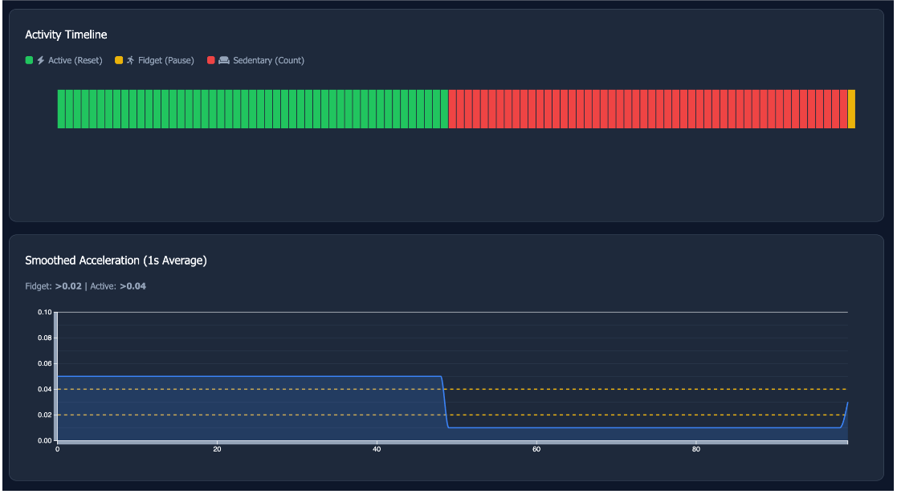
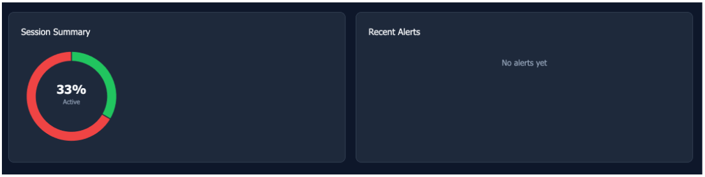

# Sedentary Activity Tracker (Sedex)

**Muhammad Otah Bashi**

## 1. Introduction – Physiological Problem

Prolonged sedentary behavior(extended periods of sitting with minimal movement) is common in modern work and study environments, yet individuals often remain unaware of how inactive they are during the day. This lack of real-time awareness represents the core problem. When sedentary behavior goes unnoticed in the moment, there is no opportunity to interrupt it through standing, stretching, or brief activity breaks.

Real-time feedback systems address this gap by providing immediate information about current activity states rather than retrospective summaries. If users can see they have been inactive for an extended period, they can take corrective action immediately. Throughout Media Management and Innovation&Complexity Management lectures, our group developed a **Sedentary Activity Tracker** that continuously monitors movement through Arduino sensors and visualizes sedentary behavior via a web dashboard. My individual contribution focused specifically on **frontend development and real-time data visualization**, implementing the browser interface that makes sensor data interpretable and actionable.

```
┌─────────────────────────────────────────────────────────────────────────────┐
│                         TWO-PATH ARCHITECTURE                               │
├─────────────────────────────────────────────────────────────────────────────┤
│                                                                             │
│   ┌─────────────┐     ┌─────────────────────────────────────────┐           │
│   │   Arduino   │     │         Rust Server (:8000)             │           │
│   │             │Serial│                                         │           │
│   │   MPU6050   │─────►│  serial.rs ──┬─► Redis ──► WebSocket ──┼──► Browser│
│   │  PIR Sensor │115200│              │  (Cache)    (Real-time)  │     (D3.js)
│   │  RTC Clock  │ JSON │              │                          │           │
│   └─────────────┘     │              └─► PostgreSQL ─────────────┼──► FHIR API
│                       │                  (Storage)               │           │
│                       └─────────────────────────────────────────┘           │
│                                                                             │
│   ┌─────────────────────────────────────────────────────────────┐           │
│   │                 Python ML Service (Nightly)                 │           │
│   │                                                             │           │
│   │  PostgreSQL ─► Pandas ─► KMeans ─► Daily Summary ─► PostgreSQL          │
│   └─────────────────────────────────────────────────────────────┘           │
└─────────────────────────────────────────────────────────────────────────────┘
```

*Figure1 - System architecture overview showing Arduino sensor setup, Rust backend with dual-path data processing (Redis for real-time streaming, PostgreSQL for persistence), and browser-based dashboard connected via WebSocket.*

## 2. Technical Solution and Architecture

### 2.1 System Overview

The system uses an Arduino microcontroller with three sensors: an **MPU6050 accelerometer** for detecting body movement, a **PIR motion sensor** for larger-scale movements, and a **DS3231 RTC clock** for timestamps. Sensors sample at **10 Hz** and transmit JSON messages over serial connection at **115200 baud**.

The Rust backend classifies readings into three states (Active, Fidgeting, Sedentary) using two acceleration thresholds (Fidget: 0.020 g, Active: 0.040 g) and maintains a sedentary timer that resets during activity, pauses during fidgeting, and increments during sedentary states. An alert triggers after 20 minutes of continuous inactivity.

The architecture follows a two-path design:

1. **Real-time path:** Redis caches the most recent 100 messages and broadcasts them via WebSocket to browser clients for immediate updates.
2. **Persistent path:** PostgreSQL stores all readings for historical analysis.

This separation ensures dashboard responsiveness independent of database performance.

### 2.2 Frontend Architecture and Implementation

I developed the browser-based dashboard as a static web application served by the Rust backend. The frontend uses:

- HTML for layout
- CSS for dark theme styling
- JavaScript for client logic
- D3.js v7 for all chart rendering

The dashboard establishes a WebSocket connection to ws://<host>/ws on page load. The backend immediately sends 100 cached messages from Redis, allowing charts to populate instantly rather than starting empty. Incoming messages follow a simple JSON format: state (ACTIVE/FIDGET/SEDENTARY), timer (sedentary seconds), val (acceleration value), alert (boolean), and timestamp.

Each message triggers an update cycle: parse data, update internal arrays, re-render all visual components. The dashboard maintains 100-point buffers for acceleration and timeline data, ensuring smooth scrolling visualization.

**Dashboard Components Implemented:**

**Connection Status:** Header indicator showing "Connecting…", "Connected", or "Disconnected" with a pulsing dot.

**Activity Status Indicator:** A large circular display that changes color based on current state: green (Active), yellow (Fidgeting), red (Sedentary)—with corresponding icons and text labels.

**Sedentary Timer:** Shows accumulated sedentary time in MM:SS format. The timer value comes directly from the backend, which already implements pause/reset behavior. Label text changes contextually ("Timer Reset!", "Timer Paused:", "Sedentary for:").

**Statistics Cards:** Four cards showing total readings, active percentage, longest inactive duration, and alert count.

**Activity Timeline:** A horizontal bar chart visualizing the last 100 samples as color-coded bars (red/yellow/green), providing immediate historical context.

**Smoothed Acceleration Line Chart:** Real-time line chart with two horizontal threshold lines (0.020, 0.040) showing how sensor values correspond to state classifications.

**Session Summary Donut Chart:** Displays active versus inactive time proportions with a center percentage value.


*Figure2 - Dashboard main view showing activity status indicator, sedentary timer, and connection status.*


*Figure3 - Real-time acceleration chart with threshold lines and activity timeline bar chart showing color-coded state history.*


*Figure4 - Session summary donut chart and alert history panel with triggered sedentary warnings.*

All logic is implemented in approximately 400 lines of vanilla JavaScript without external frameworks. D3.js handles chart complexity while JavaScript manages WebSocket communication and application state.

### 2.3 Backend and Extended Features

The Rust backend provides WebSocket streaming (/ws), REST endpoints for health checks and authentication, and writes all readings to PostgreSQL. Redis serves as fast-access cache for reconnection history. The system includes a FHIR-compatible endpoint (/api/fhir/observation/latest) that returns readings as HL7 FHIR Observation resources with custom LOINC codes—this demonstrates interoperability standards but is not a production healthcare system. A Python script performs nightly batch analysis using KMeans clustering to identify behavioral patterns and suggest threshold calibrations, storing daily summaries in an activity_summary table. These ML outputs are not integrated into the live dashboard.

## 3. Results and Analysis Including Interpretation

The implemented system successfully provides real-time visual responsiveness. State changes from sedentary to active update the dashboard within milliseconds across all synchronized visual components. This immediacy is critical because the system's value depends on real-time awareness rather than delayed reporting.

Clarity of activity states is achieved through consistent color semantics (green/yellow/red) across all components with redundant signals—color, icon, text, and chart position. This redundancy enables quick interpretation even through peripheral vision. The sedentary timer converts abstract inactivity into concrete, understandable metrics (accumulated minutes and seconds), making prolonged sedentary episodes tangible.

The reconnection design proved valuable during testing. Because Redis caches recent messages, the dashboard repopulates charts immediately after page refresh or connection drops rather than starting empty. The dark theme reduces eye strain for prolonged viewing, aligning with an always-visible monitoring use case.

**Limitations must be acknowledged:**

**Single-user focus:** The dashboard visualizes one stream without per-user contexts or personalization. While the backend includes authentication, the frontend does not implement user-specific views or configurations.

**No UI-based configuration:** Classification thresholds and alert timing are hardcoded. Users cannot adjust these through the interface.

**Sensor dependence:** Classification accuracy depends on proper sensor placement and mounting. The dashboard faithfully displays backend classifications but cannot compensate for poor sensor positioning or noise.

**Limited historical visualization:** The dashboard shows only current session data. ML-generated daily summaries exist in the database but are not exposed through the frontend.

**Non-clinical scope:** Despite FHIR endpoints and healthcare terminology, this is an academic prototype without medical validation, user studies, or regulatory review. Classification thresholds are empirically tested, not clinically derived.

## 4. Individual Responsibility, Learnings, and Challenges

### 4.1 My Individual Contributions

As Frontend Developer, I implemented the complete browser dashboard: HTML structure, CSS dark theme, JavaScript WebSocket connection with reconnection logic, message parsing with defensive error handling, all D3.js visualizations (acceleration chart, timeline, donut chart), activity status indicator with contextual styling, sedentary timer display, statistics cards, and alert history panel. I collaborated with backend developers to establish WebSocket message format and ensure frontend-backend compatibility.

### 4.2 Key Learnings

This project expanded my understanding of real-time web applications beyond traditional request-response patterns. WebSocket-driven applications require event-driven architectures where the server pushes data continuously and the frontend reacts without user interaction.

Working with D3.js for live data taught me to distinguish between chart initialization (creating scales and elements once) and data updates (rebinding and updating attributes), crucial for smooth animation at 10 Hz update rates.

I learned about system boundaries and interfaces—the frontend depends entirely on backend message format and timing. Console logging strategies for inspecting raw WebSocket messages became essential for validating assumptions about data structures during development.

### 4.3 Main Challenges

Maintaining visual stability during continuous updates required separating chart initialization from data updates. Early implementations reconstructed entire charts on each message, causing flicker. I solved this by creating static elements once and updating only data-bound paths.

Synchronizing multiple UI elements that respond to the same message required careful sequencing. I implemented a single update cycle—parse message, update all state variables, call all rendering functions synchronously—ensuring the UI never displays partially updated state.

Translating raw sensor values into understandable visuals required design iterations. Informal feedback from non-technical team members revealed that labels needed to be more explicit and that visual redundancy (icon plus text plus color) was necessary for immediate comprehension.

## Conclusion

The Sedentary Activity Tracker demonstrates real-time active monitoring through integrated hardware-software design. My frontend contribution—the dashboard and visualization layer—transforms raw sensor data into interpretable visual feedback about activity states and sedentary behavior. The implementation achieved immediate responsiveness, clear state presentation, and robust reconnection handling, while acknowledging limitations in personalization, historical visualization, and clinical validation. This project provided practical experience with real-time web architecture, event-driven design, and the complexities of hardware-driven data visualization.