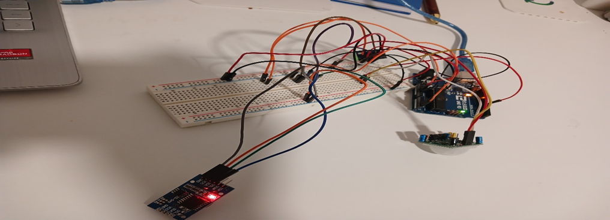
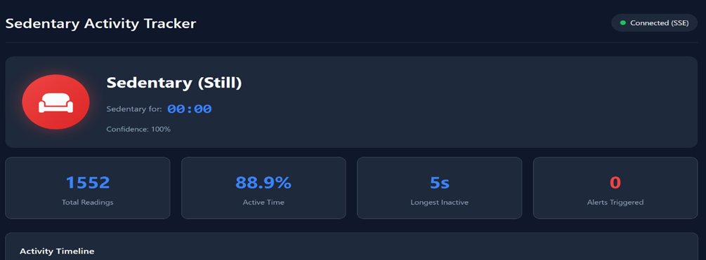
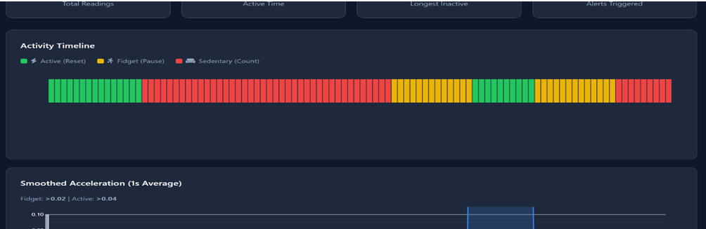

# SEDEX
## A SEDENTARY BEHAVIOUR TRACKER SYSTEM

**MATRICULATION NUMBER:** 22402632  
**BACHELOR IN HEALTH INFORMATICS**  
**3RD SEMESTER**

---

A prolonged sedentary lifestyle has become among the most persistent public health issues in modern society (Owen et al., 2010; Tremblay et al., 2017; Wilmot et al., 2012). Studys show the average adult spends approximately 9.5 hours per day in a seated manner at work, in vehicles, and during leisure time (Owen et al., 2010; Tremblay et al., 2017) Many hours of uninterrupted sitting have increasing physiological consequences such as increased risk of premature death, cardiovascular disease, type 2 diabetes, several types of cancers, even in people who otherwise exercise and have a normal weight. (Biswas et al., 2015; Ekelund et al., 2016; Wilmot et al., 2012). It also shows that both the total sedentary time and the length of each sitting bout matter. Long, continuous sitting is associated with significantly higher mortality risk than shorter bouts broken up by brief movement (Healy et al., 2008; Ekelund et al., 2016; Owen et al., 2010)

The specific physiological problem targeted by this project is the harmful lifestyle of total sedentary, uninterrupted sitting bouts during the day. When sitting stretches beyond 20 – 30 minutes at a time, skeletal muscle contractions decrease significantly, leading to impaired triglyceride and glucose clearance, reduced insulin sensitivity, and other metabolic and vascular problems that accumulate over the years (Hamilton et al., 2007). Many people are unaware of the micro-risks associated with a sedentary lifestyle.

The Sedentary Activity Tracker is designed to address this gap between risk and awareness by continuously monitoring movement and detecting when the body has crossed from healthy activity into potentially harmful stillness. It is also designed for the general public as more and more of our lives, from work, school, to leisure activities, are spent sitting.

## TECHNICAL SOLUTION

The technical solution is an end-to-end monitoring system that turns raw motion data into actionable sedentary state decisions. Delivered to a browser dashboard for live viewing, also stored JSON for clinical-style reporting. Additionally, ML analysis and classification. It is a multi-tier system; with edge sensoring on Arduino, stream processing in a Rust backend, ML analysis and classification, low-latency caching in Redis, persistence storage in PostgreSQL, and an optional offline analytics for daily, weekly, and monthly averages.

## HARDWARE LAYER

The Arduino is responsible for stable sensor data capture and reading. Using an Arduino Uno included with an MPU6050 accelerometer/gyroscope, an HC-SR501 PIR motion sensor, and a DS3231 RTC for precise timing, all connected with a Breadboard. The MPU6050 detects small body movements by measuring changes in acceleration, while the PIR sensor captures larger movements within its infrared vision. The DS3231 provides accurate timestamps, enabling it to calculate continuous inactivity duration. Overall, the system demonstrates a robust multi-sensor method for monitoring and analyzing human sedentary behavior.

## BACKEND LAYER

The backend reads raw JSON from the Arduino over a configured serial port and smooths the acceleration signal. Classification also happens here; each sample is converted into one of three states: ACTIVE, FIDGET, or SEDENTARY. There is also a sedentary timer alert and a normalized Processed State event that is simultaneously sends to the frontend, cached in Redis, and saved to PostgreSQL. Additionally, the backend exposes multiple HTTP endpoints for health checks, authentication, and statistics, as well as a FHIR observations API for healthcare integration.

The sedentary timer resets on ACTIVE, pauses during FIDGET, and increases while it is on SEDENTARY. The Processed State is broadcasted through an internal mechanism so that different components, streaming, and persistence can react independently. Cache the most recent 500 readings in Redis to instantly fill charts when a user reconnects on the frontend. Persist every processed reading to the sedentary_log table, and optionally mirror it into the sensor_data table for user-level statistics.

Serve REST and streaming endpoints, including health checks, signup/login, JWT token authentication, and a FHIR Observation endpoint exposing the latest reading in a standardized format.

Core data flow: The serial module opens the configured serial port, i.e., the serial port and baud rate. Reads from the Arduino sketch, each line is parsed into a raw reading structure, and the acceleration component is smoothed using a 10-sample moving window to reduce noise. Classification logic: ACTIVE if pir equals 1 or smoothed_acceleration > 0.040. FIDGET if smoothed_acceleration > 0.020 and SEDENTARY if smoothed_acceleration <= 0.020 or pir == 0. Each classified reading is converted into a processed state that includes state, timer, acceleration value, alert flag, and timestamp. Once a processed state is created, it is sent through the Tokio crate to a broadcast channel so multiple elements inside the backend can subscribe without tight coupling. In parallel, the same processed state is appended to a Redis list named sensor_history. After each push, the list is trimmed to a maximum length of 500 entries so that Redis always holds a brief, recent window of activity that can immediately fill any new dashboard connection. The database configuration subscribes to the broadcast channel. For every incoming processed data, it inserts a row into the sedentary_log table, which stores state, timer, acceleration value, and timestamp. The configuration is also set to write a corresponding row into the sensor_data table linked to that user, making user-centered aggregations and powering the statistics endpoint possible.

The system also supports pushing updates to browsers using Server-Side Events as the default and WebSockets as a fallback to drive live dashboards. On the frontend, D3.js creates a live status indicator and charts by subscribing to these streamed events and redrawing small parts of the DOM at each update. Web clients can connect via SSE to GETevents for a server-push, one-way event stream. Alternatively, they can use WebSocket at GET for a bidirectional channel that supports future interactive features, such as remote calibration. There is a fallback module that monitors the flow of serial data. If no new readings arrive for 10 seconds, it treats the hardware as unavailable. This prevents the UI from becoming empty or stale, it also fetches the last 500 rows of data from the database table sedentary_log. It replays these rows into the Redis sensor_history table and pushes them through the broadcast channel. This keeps the frontend functioning until new data arrives.

Machine Learning service has also been implemented in project, it reads daily slices from PostgreSQL and uses clustering KMeans to discover recurring patterns, e.g., "long morning sedentary blocks" vs "frequent micro-breaks". This design matches how clustering is used in physical activity literature to group individuals or days by movement profiles and sedentary patterns. Outputs are written back as daily summaries, e.g., dominant state, activity score, enabling longitudinal feedback beyond real-time alerts.

## Results and Analysis With Interpretation

The sedentary tracker successfully captures raw Arduino motion data, classifies it into three states: ACTIVE, FIDGET, and SEDENTARY, and streams both live and historical data to the dashboard. The backend processes readings at 10 Hz, smooths acceleration over a 10-sample window, and applies thresholds (0.020 for FIDGET, 0.040 for ACTIVE) combined with PIR events to determine state. This yields a stable, low-noise signal for real-time visualization and alerts.

The backend consistently produces processed data payloads and delivers them through SSE/WebSocket smoothly with negligible latency. The Redis cache retains the most recent 500 readings, allowing instant graph population upon web page load, followed by seamless transition to live updates.

Processed readings are stored in PostgreSQL. This provides a reliable historical record for analytics and auditing. The fallback mechanism uses this log to replay the latest 500 samples when no live serial data arrives, keeping the UI functional even if Arduino hardware is disconnected. Sample output shows repeated low-variance acceleration readings with periodic spikes. These spikes typically push smoothed acceleration above the fidget threshold and occasionally above the active threshold, producing state changes consistent with expected movement patterns. The sedentary timer behaves predictably: it resets on ACTIVE, pauses on FIDGET, and increments on SEDENTARY.

The chosen thresholds strike a reasonable balance between sensitivity and stability. The smoothing window reduces jitter but preserves meaningful motion changes. The combined use of PIR and acceleration provides a robust classification signal: PIR handles gross movement, while acceleration catches smaller fidgeting behavior. This dual-sensor approach improves interpretability and reduces false stillness.

ACTIVE spikes correspond to precise body movement or PIR triggers and should be interpreted as periods of high activity.

FIDGET readings indicate slight movement that does not reset the sedentary timer, aligning with the intent to differentiate between meaningful activity and micro-movements.

SEDENTARY periods represent sustained low-motion periods. The sedentary timer provides a straightforward measure of inactivity duration and supports alerts after prolonged stillness.

In summary, the system's processing pipeline is stable, classifications are interpretable, and its fallback architecture ensures usability even when hardware is unavailable. The resulting data is suitable both for real-time feedback and longitudinal analysis.

## RESPONSIBILITIES, INDIVIDUAL LEARNINGS, AND CHALLENGES

I was the Lead of the group for this project and did a lot of the work. I was responsible for the hardware, systems, and RUST core. In the hardware implementation, I had to connect the PIR, accelerometer/gyroscope, RTC, Breadboard, and make sure it works, and a signal is produced. Wrote the Arduino C++ sketch for the parsing of data and POST data to the Rust APIs. For the system, I first had to containerize the project in Docker and manage dependencies with Cargo.toml and Cargo.lock, implement Unit and Integration tests, create GitHub/workflows, i.e., CI/CD pipelines. Finally, I wrote the central RUST core for the project. Beginning with the entry point that initializes from the hardware and starts the Axum server, define the functions to combine all routes and database pools, implement the RUST side logic to spin up the server, and read the configuration. Wrote the code to read settings from configuration yaml and environment variables, set up the tracing subscriber to log every request ID and error for debugging, the health check logic to return 200 OK for uptime monitoring, and the endpoint that receives JSON data from the hardware. Lastly, I implemented the authentication JWT logic for login/signup handlers inside routes using the argon2 and jsonwebtoken crates. I learned a lot on the RUST Axum server, the importance of CI/CD pipelines, the significance of unit and integration tests, debugging, and RUST APIs. Apart from the programming perspective, I gained a lot of helpful information on the dangers of a sedentary lifestyle. The micro-problems that accumulate over the years, and yet many people don't know many of them, and the necessity for an adoption of an active lifestyle The significant challenges I faced was coming up with the idea as a group, writing and working with Rust was an uphill battle and finally creating an effective CI/CD pipeline with unit and integration test was challenging.

*Figure 1: Connection of the Arduino and sensors*

*Figure 2: The Frontend Display*

*Figure 3: Frontend Display 2*

## REFERENCES

Biswas, A., Oh, P. I., Faulkner, G. E., Bajaj, R. R., Silver, M. A., Mitchell, M. S., & Alter, D. A. (2015). Sedentary time and its association with risk for disease incidence, mortality, and hospitalization in adults: A systematic review and meta-analysis. *Annals of Internal Medicine*, 162(2), 123–132. https://doi.org/10.7326/M14-1651

Ekelund, U., Tarp, J., Steene-Johannessen, J., Hansen, B. H., Jefferis, B., Fagerland, M. W., Whincup, P., Diaz, K. M., Hooker, S. P., Chernofsky, A., Larson, M. G., Spartano, N., Vasan, R. S., Dohrn, I. M., Hagströmer, M., Edwardson, C., Yates, T., Shiroma, E., Anderssen, S. A., & Lee, I.-M. (2019). Dose–response associations between accelerometry-measured physical activity and sedentary time and all-cause mortality: Systematic review and harmonised meta-analysis. *BMJ*, 366, l4570. https://doi.org/10.1136/bmj.l4570

Hamilton, M. T., Hamilton, D. G., & Zderic, T. W. (2007). Role of low energy expenditure and sitting in obesity, metabolic syndrome, type 2 diabetes, and cardiovascular disease. *Diabetes*, 56(11), 2655–2667. https://doi.org/10.2337/db07-0882

Healy, G. N., Wijndaele, K., Dunstan, D. W., Shaw, J. E., Salmon, J., & Owen, N. (2008). Objectively measured sedentary time, physical activity, and metabolic risk: The Australian Diabetes, Obesity and Lifestyle Study (AusDiab). *Diabetes Care*, 31(2), 369–371. https://doi.org/10.2337/dc07-1795

Owen, N., Bauman, A., & Brown, W. (2009). Too much sitting: A novel and important predictor of chronic disease risk? *British Journal of Sports Medicine*, 43(2), 81–83. https://doi.org/10.1136/bjsm.2008.055269

Tremblay, M. S., Aubert, S., Barnes, J. D., Saunders, T. J., Carson, V., Latimer-Cheung, A. E., Chastin, S. F. M., Altenburg, T. M., & Chinapaw, M. J. M. (2017). Sedentary Behavior Research Network (SBRN) – Terminology consensus project process and outcome. *International Journal of Behavioral Nutrition and Physical Activity*, 14, Article 75. https://doi.org/10.1186/s12966-017-0525-8

Wilmot, E. G., Edwardson, C. L., Achana, F. A., Davies, M. J., Gorely, T., Gray, L. J., Khunti, K., Yates, T., & Biddle, S. J. H. (2012). Sedentary time in adults and the association with diabetes, cardiovascular disease, and death: Systematic review and meta-analysis. *Diabetologia*, 55(11), 2895–2905. https://doi.org/10.1007/s00125-012-2677-z